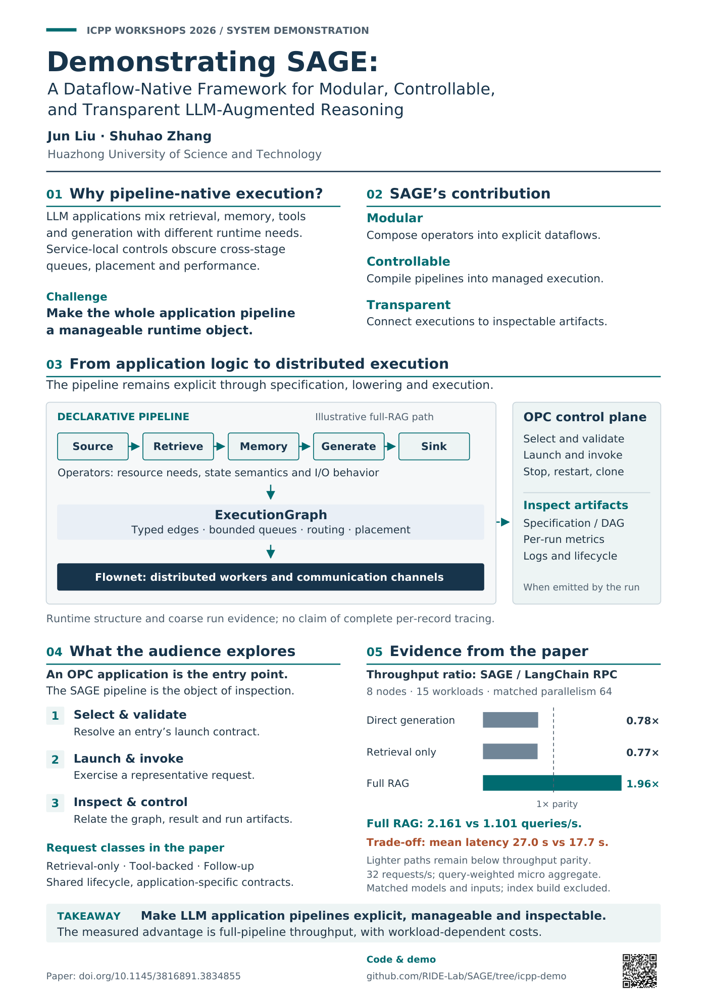

# ICPP Demo poster — revision 4

A0 portrait (841 × 1189 mm, provisional size). PDF fonts embedded; SVG is editable. Footer URL,
clickable PDF link and vector QR all target https://github.com/RIDE-Lab/SAGE/tree/icpp-demo .

QR is 50 mm square with a four-module quiet zone; decoded successfully from 75/150 dpi PDF renders.
Physical printing/scanning not tested. Paper title, authors, diagrams and experimental values are
unchanged. Full generation sources and provenance accompany the local poster delivery.

